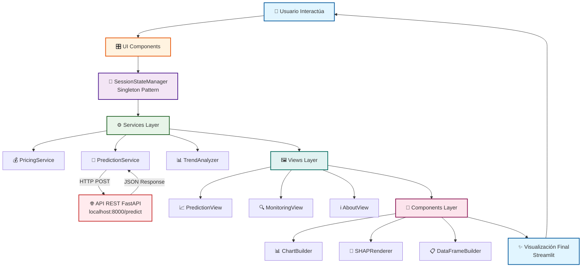

# Arquitectura Modular - Sistema Predictivo de Demanda

## Descripción General

La aplicación frontend está construida con **Streamlit** siguiendo los principios **SOLID** y patrones de diseño modernos. La arquitectura modular facilita el mantenimiento, testing y escalabilidad del sistema.

**Arquitectura Desacoplada:** El frontend se comunica exclusivamente con el Backend REST API (FastAPI) mediante HTTP. No hay carga local de modelos.

## Estructura del Proyecto

```text
app/
├── app.py                          # Punto de entrada principal
├── config.py                       # Configuraciones centralizadas
├── state_manager.py                # Gestión de estado (Singleton Pattern)
│
├── services/                       # Lógica de negocio
│   ├── __init__.py
│   ├── pricing_service.py          # Gestión de precios dinámicos por categoría
│   ├── prediction_service.py       # Cliente HTTP para API REST (httpx)
│   └── trend_analyzer.py           # Análisis de tendencias y deltas
│
├── components/                     # Componentes de visualización
│   ├── __init__.py
│   ├── chart_builder.py            # Constructor de gráficos Plotly (Builder Pattern)
│   ├── shap_renderer.py            # Renderizado SHAP con soporte dark/light theme
│   └── dataframe_builder.py        # Constructor de DataFrames para visualización
│
├── views/                          # Vistas principales de la aplicación
│   ├── __init__.py
│   ├── prediction_view.py          # Vista de análisis predictivo (KPIs, SHAP, gráficos)
│   ├── monitoring_view.py          # Vista de salud del modelo + Panel de mantenimiento
│   └── about_view.py               # Vista de información del proyecto
│
└── ui_components/                  # Componentes de interfaz de usuario
    ├── __init__.py
    ├── sidebar.py                  # Barra lateral con formulario de predicción
    └── header.py                   # Encabezado con branding
```

## Principios SOLID Aplicados

### **S - Single Responsibility Principle (SRP)**

- **Una clase = Una responsabilidad**
- 18 archivos Python, cada uno con una única clase
- Ejemplos:
  - `PricingService`: Solo gestión de precios
  - `ChartBuilder`: Solo construcción de gráficos
  - `MonitoringView`: Solo renderización de vista de monitoreo

### **O - Open/Closed Principle (OCP)**

- Clases abiertas para extensión, cerradas para modificación
- Fácil agregar nuevos tipos de gráficos sin modificar `ChartBuilder`
- Nuevas estrategias de pricing sin alterar `PricingService`

### **L - Liskov Substitution Principle (LSP)**

- Componentes intercambiables con interfaces consistentes
- Todos los servicios siguen patrones de inicialización y métodos públicos similares

### **I - Interface Segregation Principle (ISP)**

- Interfaces específicas por dominio
- `PredictionService`: Solo métodos de predicción
- `TrendAnalyzer`: Solo análisis de tendencias

### **D - Dependency Inversion Principle (DIP)**

- Dependencias en abstracciones, no en implementaciones concretas
- Las vistas dependen de servicios (abstracción), no de implementaciones específicas
- `SessionStateManager` como abstracción del estado global

## Flujo de Datos



## Componentes Clave

### Capa de Servicios (services/)

#### `pricing_service.py` - **PricingService**

- Gestión de precios dinámicos por categoría
- Cálculo de rangos de precios (±200% del promedio)
- Actualización automática según categoría seleccionada
- Integración con `category_prices.pkl`

**Métodos principales:**
#### `prediction_service.py` - **PredictionService**

- Cliente HTTP para comunicación con Backend API REST
- Realiza predicciones mediante POST a `/predict`
- Maneja errores de conexión y timeouts
- **NO carga modelos localmente** (arquitectura desacoplada)

**Métodos principales:**

```python
predict(input_data: Dict) -> float          # POST a API REST
check_api_health() -> bool                  # GET a /health
_handle_api_error(error: Exception) -> None # Manejo de errores HTTP
```

**Dependencias:**
- `httpx.Client` para requests HTTP
- Timeout de 30 segundos por request
- Validación de disponibilidad de API antes de predicción
**Métodos principales:**

```python
predict(input_data: Dict) -> float
get_shap_values(input_data: Dict) -> Tuple[np.ndarray, np.ndarray]
```

#### `trend_analyzer.py` - **TrendAnalyzer**

- Análisis de tendencias de ventas
- Cálculo de deltas y porcentajes de cambio
- Determinación de estados (positivo/negativo)
- Asignación de colores para visualización

**Métodos principales:**

```python
analyze_trend(values: List[float]) -> Dict
get_trend_color(delta: float) -> str
```

### Capa de Componentes (components/)

#### `chart_builder.py` - **ChartBuilder** (Builder Pattern)

- Constructor de gráficos Plotly reutilizables
- Tipos: barras, dispersión, histogramas, series temporales
- Configuración consistente (colores, layout, estilos)

**Métodos principales:**

```python
create_bar_chart(df, x, y) -> go.Figure
create_temporal_chart(df, colors) -> go.Figure
create_scatter_chart(df, x, y) -> go.Figure
create_histogram(data) -> go.Figure
```

#### `shap_renderer.py` - **SHAPRenderer**

- Renderizado de gráficos SHAP con soporte para temas dark/light
- Inyección dinámica de CSS según el tema actual
- Compatibilidad con `st.theme` de Streamlit

**Métodos principales:**

```python
render_shap_plot(shap_values, base_value, feature_names, feature_values) -> None
```

#### `dataframe_builder.py` - **DataFrameBuilder**

- Constructor de DataFrames para visualización
- Datos de tendencias temporales
- Datos de monitoreo y métricas

**Métodos principales:**

```python
create_trend_dataframe(lag_3, lag_2, lag_1) -> pd.DataFrame
create_monitoring_dataframe(dates, residuals) -> pd.DataFrame
```

### Capa de Vistas (views/)

#### `prediction_view.py` - **PredictionView**

- Vista principal de análisis predictivo
- Renderiza KPIs, gráficos SHAP y proyecciones temporales
- Maneja estados: espera, cálculo, resultados
#### `monitoring_view.py` - **MonitoringView**

- Vista de salud y rendimiento del modelo
- Consume métricas desde API REST (GET `/metrics`)
- Métricas: RMSE, MAE, R² Score de todos los modelos
- Gráficos de estabilidad y distribución de errores
- **Panel de Mantenimiento del Sistema**

**Panel de Mantenimiento:**

1. **Regenerar Datasets:**
   - Botón para forzar descarga desde KaggleHub
   - Actualiza automáticamente `data/`
   - Validación de archivos y mensajes de estado

2. **Reentrenar Modelos:**
   - Botón para ejecutar pipeline de entrenamiento
   - Genera nuevos modelos en `models/`
   - Requiere reinicio del Backend API para cargar nuevos modelos

#### `about_view.py` - **AboutView**

- Vista de información del proyecto
- Descripción de arquitectura y tecnologías
- Integrantes del equipo
- Documentación de uso
   - Carga nuevos modelos sin reiniciar

#### `architecture_view.py` - **ArchitectureView**
#### `sidebar.py` - **Sidebar**

- Barra lateral con formulario de predicción simplificado
- Selector de categoría con callback dinámico
- Inputs: shop_cluster, item_price, lag_1, lag_2, lag_3
- Gráfico de tendencia de lags
- Botón de predicción

**Características:**

- Actualización automática de precio al cambiar categoría
- Validación de inputs numéricos
- Integración con `PricingService`
- **Sin configuración de API** (modo REST exclusivo)
- Botón de predicción

**Características:**

- Actualización automática de precio al cambiar categoría
- Validación de inputs
- Integración con `PricingService`

#### `header.py` - **Header**

- Encabezado de la aplicación
- Logo y título con íconos Material Design
- Estilo consistente

### Gestión de Estado (state_manager.py)

#### `SessionStateManager` (Singleton Pattern)

- Gestión centralizada del estado de la sesión
- Abstracción sobre `st.session_state`
- Métodos helper para lectura/escritura segura

**Métodos principales:**

```python
initialize_state(...) -> None
get_value(key: str, default: Any = None) -> Any
set_value(key: str, value: Any) -> None
update_price_range(min_price, max_price) -> None
```

### Configuración (config.py)

Centraliza todas las configuraciones de la aplicación:

- **Mapas:** `CLUSTER_MAP` (descripción de clusters)
- **Precios:** `DEFAULT_PRICE`, `PRICE_RANGE_MULTIPLIER`, `PRICE_RANGE_MAX_MULTIPLIER`
- **Temas:** Colores para dark/light mode
- **Gráficos:** Paleta de colores consistente

## Extensión y Desarrollo

### Agregar una Nueva Vista

```python
# En views/new_view.py
import streamlit as st

class NewView:
    """Nueva vista del sistema."""
    
    def __init__(self):
        """Inicializa la vista."""
        pass
    
    def render(self) -> None:
        """Renderiza la vista."""
        st.header("Nueva Vista")
        # Implementación

# En views/__init__.py
from .new_view import NewView
__all__ = [..., "NewView"]

# En app.py
from app.views import NewView

with tab_new:
    NewView().render()
```

### Agregar un Nuevo Servicio

```python
# En services/new_service.py
class NewService:
    """Nuevo servicio de negocio."""
    
    def __init__(self, dependency):
        """Inicializa el servicio."""
        self.dependency = dependency
    
    def perform_action(self, data):
        """Realiza acción de negocio."""
        # Lógica
        pass

# En services/__init__.py
from .new_service import NewService
__all__ = [..., "NewService"]
```

### Agregar un Nuevo Componente

```python
# En components/new_component.py
class NewComponent:
    """Nuevo componente de visualización."""
    
    @staticmethod
    def create_custom_chart(data):
        """Crea gráfico personalizado."""
        # Lógica de visualización
        return chart

# En components/__init__.py
from .new_component import NewComponent
__all__ = [..., "NewComponent"]
```

## Patrones de Diseño Utilizados

1. **Singleton Pattern**: `SessionStateManager` - Única instancia del estado global
2. **Builder Pattern**: `ChartBuilder`, `DataFrameBuilder` - Construcción paso a paso de objetos complejos
3. **Service Layer Pattern**: Separación de lógica de negocio de la presentación
4. **Dependency Injection**: Servicios inyectados en constructores de vistas
5. **Strategy Pattern**: Diferentes estrategias de pricing y análisis

## Testing (Estructura Sugerida)

La arquitectura modular facilita el testing unitario:

```python
# tests/services/test_pricing_service.py
from app.services import PricingService

def test_pricing_service():
    service = PricingService(cat_prices, ...)
    service.update_price_for_category(1)
    min_price, max_price = service.get_current_price_range()
    assert min_price < max_price

# tests/components/test_chart_builder.py
from app.components import ChartBuilder
import pandas as pd

def test_chart_builder():
    builder = ChartBuilder()
    df = pd.DataFrame({"x": [1, 2, 3], "y": [10, 20, 30]})
    chart = builder.create_bar_chart(df, "x", "y")
    assert chart is not None
    assert len(chart.data) > 0
```

## Mejores Prácticas

1. **Una clase por archivo** - Facilita navegación y mantenimiento
2. **Type hints** en todas las funciones - Mejora autocompletado y detección de errores
3. **Docstrings** en cada clase y método - Documentación inline
4. **Funciones pequeñas** (≤ 30 líneas) - Más legibles y testeables
5. **Reutilización** - DRY (Don't Repeat Yourself)
6. **Convenciones PEP 8** - Estilo de código Python estándar
7. **Configuraciones centralizadas** - `config.py` como única fuente de verdad
8. **Estado centralizado** - `SessionStateManager` para estado global
9. **Imports organizados** - stdlib, third-party, local
## Ventajas de esta Arquitectura

1. **Mantenibilidad**: Código organizado y fácil de entender
2. **Testabilidad**: Componentes aislados fáciles de probar
3. **Escalabilidad**: Fácil agregar nuevas funcionalidades sin afectar código existente
4. **Reutilización**: Componentes reutilizables en diferentes contextos
5. **Separación de responsabilidades**: UI, lógica de negocio y datos separados
6. **Type Safety**: Uso extensivo de type hints para desarrollo más seguro
7. **Documentación**: Código autodocumentado con docstrings y type hints
8. **Performance**: Uso eficiente de caché de Streamlit (`@st.cache_data`, `@st.cache_resource`)
9. **Arquitectura Desacoplada**: Frontend y Backend independientes
10. **Microservicios**: Backend API REST puede escalar independientemente
11. **Facilita Deployment**: Frontend y Backend pueden desplegarse en servidores separados
7. **Documentación**: Código autodocumentado con docstrings y type hints
8. **Performance**: Uso eficiente de caché de Streamlit (`@st.cache_data`, `@st.cache_resource`)

## Enlaces Útiles

- [Documentación de Streamlit](https://docs.streamlit.io/)
- [Principios SOLID](https://en.wikipedia.org/wiki/SOLID)
- [Design Patterns](https://refactoring.guru/design-patterns)
- [PEP 8 - Style Guide](https://peps.python.org/pep-0008/)
- [Type Hints - PEP 484](https://peps.python.org/pep-0484/)

**Desarrollado por:** Equipo 9 - ACIF104  
**Universidad:** Andrés Bello  
**Año:** 2025
