# API REST - Documentación

## Arquitectura del Sistema

### Flujo de Comunicación

```mermaid
graph TB
    A[👤 Usuario - Navegador] --> B[🎨 Frontend Streamlit :8501]
    B --> C[📡 Cliente HTTP - httpx]
    C -->|POST /predict| D[🌐 Backend FastAPI :8000]
    C -->|GET /metrics| D
    C -->|GET /health| D
    D --> E[🧠 Cargador de Modelos]
    E --> F[📦 stacking_model.pkl<br/>R² = 0.999]
    E --> G[🤖 mlp_model.keras<br/>R² = 0.413]
    E --> H[🔮 lstm_model.keras<br/>R² = 0.413]
    E --> I[📊 scaler.pkl<br/>StandardScaler]
    E --> J[📈 metrics.json<br/>Comparativas]
    D -->|JSON Response| C
    C --> B
    B --> A

    style A fill:#e1f5ff,stroke:#01579b,stroke-width:2px
    style B fill:#fff3e0,stroke:#e65100,stroke-width:2px
    style C fill:#f3e5f5,stroke:#4a148c,stroke-width:2px
    style D fill:#e8f5e9,stroke:#1b5e20,stroke-width:2px
    style E fill:#fce4ec,stroke:#880e4f,stroke-width:2px
    style F fill:#ffe0b2,stroke:#e65100,stroke-width:1px
    style G fill:#ffe0b2,stroke:#e65100,stroke-width:1px
    style H fill:#ffe0b2,stroke:#e65100,stroke-width:1px
    style I fill:#ffe0b2,stroke:#e65100,stroke-width:1px
    style J fill:#ffe0b2,stroke:#e65100,stroke-width:1px
```



## Endpoints de la API

| Método | Ruta                     | Descripción                                                     |
| :----- | :----------------------- | :-------------------------------------------------------------- |
| GET    | `/`                      | Mensaje de bienvenida con rolling windows activas               |
| GET    | `/health`                | Health check (status + modelos cargados + rolling windows)      |
| GET    | `/schema`                | **Schema dinámico** de entrada según rolling windows del modelo |
| POST   | `/predict`               | Predicción de demanda (schema dinámico según rolling windows)   |
| GET    | `/metrics`               | Métricas de todos los modelos (RMSE, MAE, R²)                   |
| GET    | `/categories/{id}/price` | Precio promedio por categoría (mock data)                       |

### ⚠️ Importante: Schema Dinámico con Features Avanzadas

El schema de entrada para `/predict` es **dinámico** y acepta múltiples niveles de granularidad:

**FEATURES REQUERIDAS (mínimas):**
- **Base (3):** shop_cluster, item_category_id, item_price
- **Lags de ventas (3):** item_cnt_lag_1, item_cnt_lag_2, item_cnt_lag_3

**FEATURES OPCIONALES (calculadas automáticamente si se omiten):**
- **Lags de precio (2):** item_price_lag_1, item_price_lag_2
- **Rolling windows (4):** rolling_mean_* + rolling_std_* (×2 ventanas)

**FEATURES AUTO-GENERADAS POR LA API:**
- **Momentum (4):** delta_1_2, evolution_3m, momentum_avg, trend_direction
- **Precio (4):** price_change_pct, price_change_2m_pct, revenue_potential, elasticity
- **Desviaciones (6):** diff_to_mean_*, zscore_*, volatility_coef_* (×2 ventanas)

**Total de features usadas por el modelo: 24+**

**RESTRICCIÓN DE ROLLING WINDOWS:**
- El modelo SIEMPRE trabaja con **exactamente 2 ventanas rolling**
- Esto genera **10 features rolling**: 2 means + 2 stds + 6 desviaciones

**Ejemplos:**
- Si el modelo fue entrenado con `[3, 6]` (por defecto), el request requiere: `rolling_mean_3`, `rolling_std_3`, `rolling_mean_6`, `rolling_std_6`
- Si el modelo fue entrenado con `[2, 4]`, el request requiere: `rolling_mean_2`, `rolling_std_2`, `rolling_mean_4`, `rolling_std_4`
- Si el modelo fue entrenado con `[4, 8]`, el request requiere: `rolling_mean_4`, `rolling_std_4`, `rolling_mean_8`, `rolling_std_8`

❌ **NO es posible usar 1, 3 o más ventanas:**
- `[3]` → Error: "rolling_windows debe tener EXACTAMENTE 2 elementos"
- `[3, 6, 9]` → Error: "rolling_windows debe tener EXACTAMENTE 2 elementos"

**Para conocer el schema actual:** Consulta el endpoint `/schema` antes de hacer predicciones.

## Ejemplos de Uso

### Obtener Schema Dinámico (Nuevo)

```bash
curl http://localhost:8000/schema
```

**Respuesta:**
```json
{
  "schema": {
    "type": "object",
    "properties": {
      "shop_cluster": {"type": "integer", "minimum": 0, "maximum": 2},
      "item_category_id": {"type": "integer", "minimum": 0},
      "item_price": {"type": "number", "minimum": 0},
      "item_cnt_lag_1": {"type": "number", "minimum": 0},
      "item_cnt_lag_2": {"type": "number", "minimum": 0},
      "item_cnt_lag_3": {"type": "number", "minimum": 0},
      "rolling_mean_3": {"type": "number", "minimum": 0},
      "rolling_std_3": {"type": "number", "minimum": 0},
      "rolling_mean_6": {"type": "number", "minimum": 0},
      "rolling_std_6": {"type": "number", "minimum": 0}
    }
  },
  "rolling_windows": [3, 6],
  "required_fields": ["shop_cluster", "item_category_id", "item_price", "item_cnt_lag_1", "item_cnt_lag_2", "item_cnt_lag_3"],
  "optional_fields": ["rolling_mean_3", "rolling_std_3", "rolling_mean_6", "rolling_std_6"]
}
```

### Health Check

```bash
curl http://localhost:8000/health
```

**Respuesta:**
```json
{
  "status": "healthy",
  "models_loaded": true,
  "rolling_windows": [3, 6]
}
```

### Predicción de Demanda (Schema Dinámico - Siempre 2 Ventanas)

**Ejemplo 1: Modelo entrenado con rolling windows por defecto [3, 6]**

```bash
curl -X POST "http://localhost:8000/predict" \
  -H "Content-Type: application/json" \
  -d '{
    "shop_cluster": 2,
    "item_category_id": 40,
    "item_price": 1499.0,
    "item_cnt_lag_1": 5,
    "item_cnt_lag_2": 3,
    "item_cnt_lag_3": 4,
    "rolling_mean_3": 4.0,
    "rolling_std_3": 1.0,
    "rolling_mean_6": 3.5,
    "rolling_std_6": 1.5
  }'
```

**Ejemplo 2: Modelo entrenado con rolling windows personalizadas [4, 8]**

```bash
curl -X POST "http://localhost:8000/predict" \
  -H "Content-Type: application/json" \
  -d '{
    "shop_cluster": 2,
    "item_category_id": 40,
    "item_price": 1499.0,
    "item_cnt_lag_1": 5,
    "item_cnt_lag_2": 3,
    "item_cnt_lag_3": 4,
    "rolling_mean_4": 3.5,
    "rolling_std_4": 1.2,
    "rolling_mean_8": 3.8,
    "rolling_std_8": 1.8
  }'
```

**Nota:** Los campos `rolling_mean_*` y `rolling_std_*` son opcionales. Si se omiten, se calculan automáticamente a partir de los lags.

**Respuesta:**
```json
{
  "prediction": 4.23,
  "prediction_log": 1.78,
  "input_features": {
    "shop_cluster": 2,
    "item_category_id": 40,
    "item_price": 1499.0,
    "item_cnt_lag_1": 5.0,
    "item_cnt_lag_2": 3.0,
    "item_cnt_lag_3": 4.0,
    "rolling_mean_3": 4.0,
    "rolling_std_3": 1.0,
    "rolling_mean_6": 3.5,
    "rolling_std_6": 1.5
  },
  "model_info": {
    "model_type": "Stacking Ensemble (Random Forest + XGBoost)",
    "features_used": 10,
    "feature_names": ["shop_cluster", "item_category_id", "item_price", "item_cnt_lag_1", "item_cnt_lag_2", "item_cnt_lag_3", "rolling_mean_3", "rolling_std_3", "rolling_mean_6", "rolling_std_6"],
    "rolling_windows": [3, 6]
  }
}
```

### Obtener Métricas

```bash
curl http://localhost:8000/metrics
```

**Respuesta:**
```json
[
  {
    "model": "Random Forest",
    "rmse": 0.028,
    "mae": 0.017,
    "r2": 0.999
  },
  {
    "model": "XGBoost",
    "rmse": 0.120,
    "mae": 0.052,
    "r2": 0.984
  }
]
```

### Obtener Precio por Categoría

```bash
curl http://localhost:8000/categories/40/price
```

**Respuesta:**
```json
{
  "category_id": 40,
  "average_price": 1499.0,
  "currency": "RUB"
}
```

## Documentación Interactiva

Una vez que el backend esté corriendo, puedes acceder a:

- **Swagger UI:** [http://localhost:8000/docs](http://localhost:8000/docs)
- **ReDoc:** [http://localhost:8000/redoc](http://localhost:8000/redoc)

Estas interfaces permiten:
- Explorar todos los endpoints disponibles
- Ver esquemas de request/response
- Probar la API directamente desde el navegador
- Descargar la especificación OpenAPI
